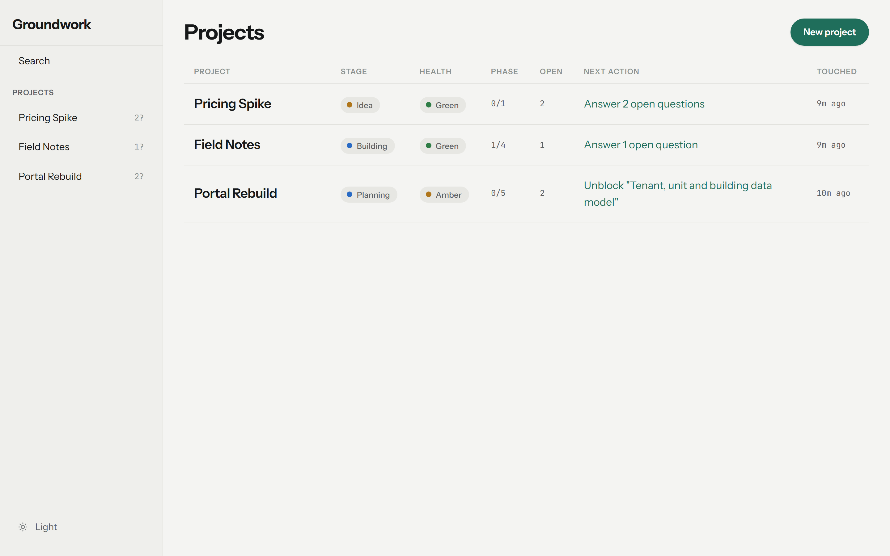
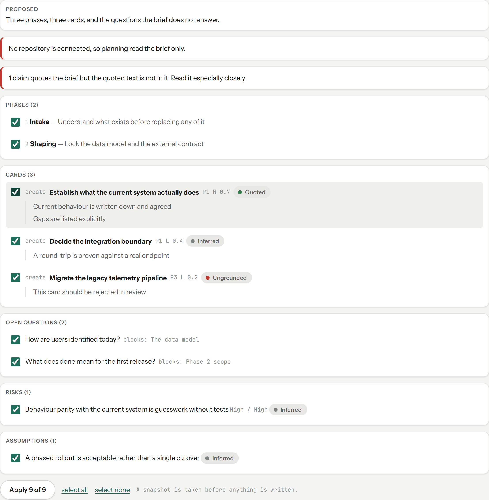
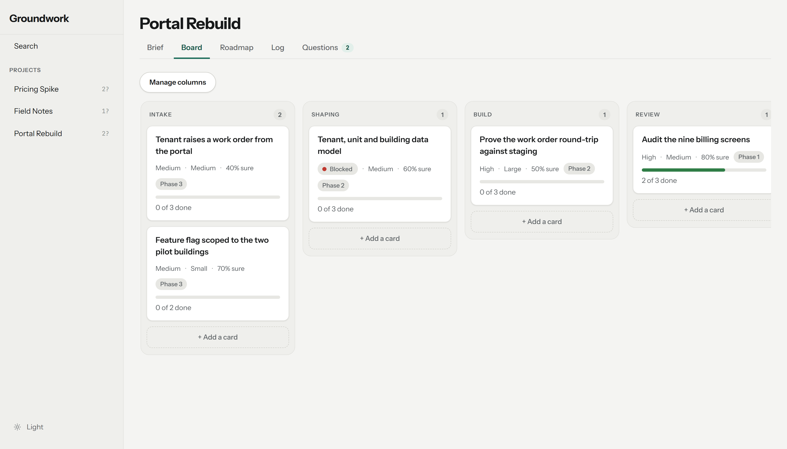
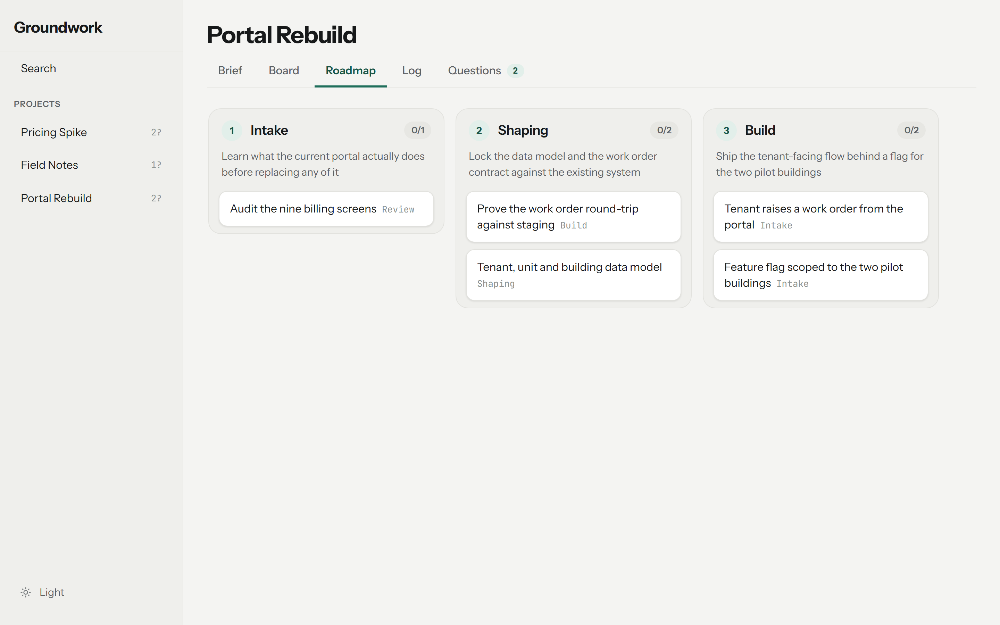
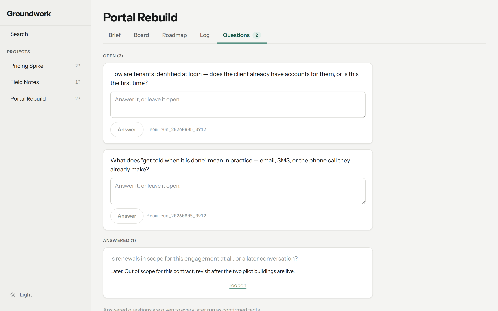
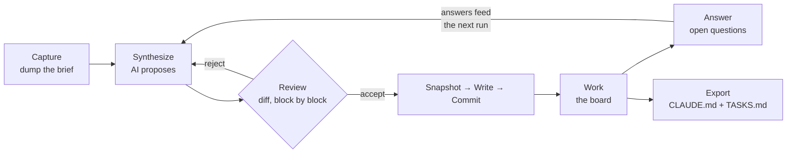
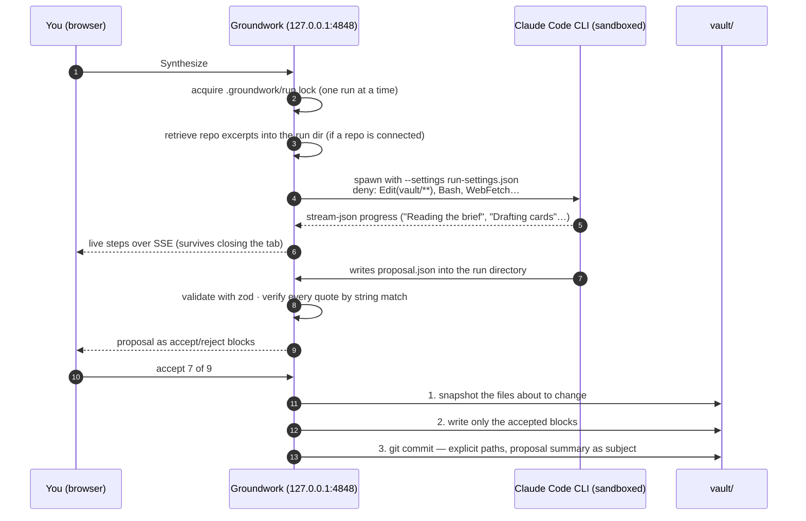
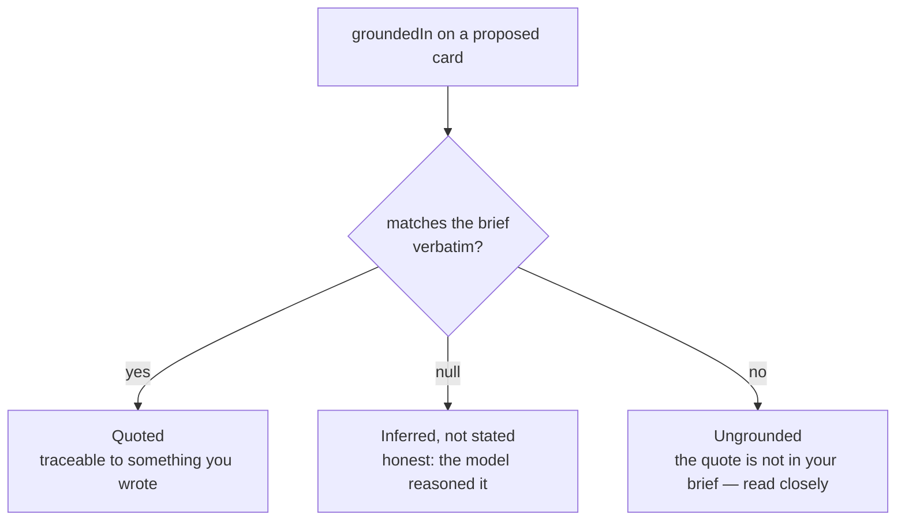

<div align="center">

# Groundwork

**A local-first planning workspace for the stage before code exists.**

Dump a messy idea into a markdown vault. AI turns it into phases, task cards, risks and the
questions it could not answer — as a *proposal you review as a diff*, never as an overwrite.
Accept what you believe, work it on a board, then hand the plan to Claude Code.

[](#how-it-works)
[](https://nextjs.org)
[](https://react.dev)
[](https://www.typescriptlang.org)
[](#development)
[](#requirements)

<picture>
  <source media="(prefers-color-scheme: dark)" srcset="docs/assets/dashboard-dark.png">
  
</picture>

</div>

---

## Table of contents

- [Why Groundwork](#why-groundwork)
- [Features](#features)
- [Quick start](#quick-start)
- [Your first project](#your-first-project)
- [How it works](#how-it-works)
  - [The core loop](#the-core-loop)
  - [The vault is the database](#the-vault-is-the-database)
  - [Anatomy of an AI run](#anatomy-of-an-ai-run)
  - [Grounding: how the AI proves it is not making things up](#grounding-how-the-ai-proves-it-is-not-making-things-up)
  - [Planning against your real code](#planning-against-your-real-code)
  - [Trust boundaries](#trust-boundaries)
- [Configuration](#configuration)
- [Limitations](#limitations)
- [Development](#development)
- [Documentation](#documentation)
- [Status and roadmap](#status-and-roadmap)
- [License](#license)

---

## Why Groundwork

Projects get started faster than they get thought through. The valuable thinking at the
beginning — what this actually is, what order it has to happen in, what I'm guessing at —
lands in a one-off `PLAN.md` with no shared shape, and six weeks later nobody remembers
why a decision went the way it did.

Generic AI planners fail this in a specific way: you paste a vague brief, they emit a
confident, complete-looking plan built mostly from template filler, and they overwrite your
file to do it. You cannot tell which parts came from what you said and which parts the model
invented.

Groundwork is **Obsidian's structure with a planning stage in the middle**, built so that
failure cannot happen:

| Principle | What it means in practice |
|---|---|
| **AI proposes, never writes** | Every run produces a proposal. You see it as a diff and accept or reject each block. A snapshot is taken before anything lands, and one click reverts. |
| **AI asks instead of inventing** | Gaps become entries in an Open Questions queue, not confident sentences. You answer; the answers feed every later run. |
| **Every claim shows its source** | Each proposed card carries a verbatim quote from your brief — or is flagged *Inferred* or *Ungrounded*. Checked by string match, not by another model. |
| **Your files stay yours** | Plain markdown with YAML frontmatter in a folder you own. Open it in Obsidian. Point Claude Code at it. No database, no account, no cloud. |

---

## Features

<table>
<tr>
<td width="50%" valign="top">

### Brief → plan, as a reviewable diff
Write the brief badly on purpose. **Synthesize** turns it into phases, cards with acceptance
criteria, risks, assumptions and open questions. Every block is accepted or rejected on its
own; nothing is written until you confirm.



</td>
<td width="50%" valign="top">

### A board that is just files
Columns are declared once in `project.md`; each card is one markdown file carrying its
column, phase, priority, size and confidence. Drag a card and `git diff` shows exactly one
file changed.



</td>
</tr>
<tr>
<td width="50%" valign="top">

### Roadmap and decision log
Phases are the only ordering — no Gantt, no dependency graph. The decision log is
prepend-only and dated server-side, because a decision you can rewrite later cannot record
what was thought at the time.



</td>
<td width="50%" valign="top">

### Open Questions that make the next run smarter
What the model does not know becomes a question. Answered questions are injected into every
later run as confirmed facts — the plan sharpens because *you* thought, not because the model
guessed better.



</td>
</tr>
</table>

**Also in the box**

- **Enhance a card** with AI that has read the whole brief and its sibling cards first, so the result fits the plan rather than being generic filler. Your hand-written criteria always survive an apply; a finished enhancement is offered again when you reopen the card, and every run is listed with its outcome.
- **Every card has its own page** — description, editable criteria, backlinks, enhancement history. Ctrl-click a tile or use the link in the drawer header to open it in a new tab.
- **Critique** a project for gaps; new risks and questions arrive through the same review flow.
- **Connect a repository** and planning is grounded in the code that exists — with citations verified against the exact bytes the model was shown. [Details below.](#planning-against-your-real-code)
- **Export** a `CLAUDE.md` + `TASKS.md` into your real project folder, previewed first, so Claude Code starts phase 1 with the whole plan.
- **Wiki-links, backlinks and vault-wide search**, Obsidian-style. Unresolved links are a note to yourself, not an error.
- **Snapshot, revert, and a scoped git commit per accepted apply** — `git log` on the vault reads as the project's decision history.
- **Command palette** (`Ctrl+K`), light/dark theme, and every screen works at 390px wide.

---

## Quick start

### Requirements

| | |
|---|---|
| **Node.js** 20+ and **pnpm** | `npm i -g pnpm` |
| **Claude Code CLI**, installed and logged in | `npm i -g @anthropic-ai/claude-code`, then `claude auth login`. Groundwork spawns it for AI work — **no API key, no per-token bill**, it rides your existing subscription. **Settings** (bottom of the rail) shows which account the CLI is signed into and how to connect if it is not. |
| **git** on `PATH` (optional) | Enables auto-commit of the vault after every accepted proposal. Everything else works without it. |
| **Windows 11** | Built and tested here. macOS/Linux spawn `claude` from `PATH` and should work, but are untested. |

### Install and run

```bash
git clone https://github.com/kimbelas/groundwork.git
cd groundwork
pnpm install

mkdir vault              # your data lives here; it is git-ignored by this repo
git -C vault init        # optional: gives you per-apply commits and a second undo path

pnpm dev                 # → http://127.0.0.1:4848
```

On Windows you can also double-click **`groundwork.cmd`**, which starts the server and opens
the browser.

> [!NOTE]
> Groundwork binds to `127.0.0.1` only. There is no login because there is no network
> exposure — but any page in your browser can reach loopback, so mutating routes still check
> `Origin` and `Sec-Fetch-Site`.

---

## Your first project

1. **New project** on the dashboard. Give it a name; the slug is derived and editable; pick
   an archetype (`saas-mvp`, `internal-tool`, `client`, `research-spike`) — it shifts what
   synthesis emphasises. This scaffolds `vault/<slug>/` with `project.md`, `roadmap.md`,
   `log.md`, `risks.md`, `questions.md` and `cards/`.
2. **Write the brief** on the Brief tab. Do not tidy it. Say what you want, who it is for,
   what you already know you do not know, and any hard constraints. Honest gaps become useful
   questions; invented certainty becomes cards you will have to reject.
3. **Synthesize.** Watch the actual steps stream in, then review the proposal. Read the
   *Inferred* and *Ungrounded* chips especially closely — that is where a model fills a template.
4. **Accept the blocks you believe.** A snapshot is taken, the files are written, the vault is
   committed. **Revert last AI change** is one click if you regret it.
5. **Answer the Open Questions**, then synthesize again. Existing cards come back as *updates*,
   never as a reset, and the model is told not to propose deleting your work.
6. **Critique** to surface risks and assumptions you have not considered. **Enhance** any
   one-line card into something with real acceptance criteria.
7. **Work the board.** Drag cards through columns. Tick acceptance criteria in the card drawer.
8. **Ready to build?** Create the real project folder, then **Export**. Groundwork previews
   and writes `CLAUDE.md` (your brief verbatim, open questions kept *as* questions) and
   `TASKS.md` (a checklist by phase) into it. Open Claude Code there.
9. **Once there is code, connect the repository** from the Brief tab. Later planning runs cite
   your actual source, and the review flags any citation it cannot verify.

Steps 3–6 are re-runnable forever. The brief is never "finished".

---

## How it works

### The core loop



### The vault is the database

There is no database. Everything is markdown with YAML frontmatter in one folder per project.
The vault is its own git repository, ignored by this one — if the app vanished tomorrow the
folder would still be useful in Obsidian, a text editor, or to Claude Code.

```
vault/
└── portal-rebuild/
    ├── project.md          frontmatter = stage, health, archetype, columns, repo
    │                       body = the Brief, free-form, never restructured by the app
    ├── cards/
    │   ├── 0001-audit-billing-screens.md
    │   └── 0002-work-order-contract.md
    ├── roadmap.md          phases: [{ n, name, goal }]
    ├── questions.md        the Open Questions queue, each with status / answer / fromRun
    ├── risks.md            risks + assumptions
    ├── log.md              decision log — prepend-only, dated
    ├── .snapshots/         copies taken before every AI apply (your undo history)
    └── .trash/             deleted cards keep their id forever
```

A card is one file:

```yaml
---
id: 2
title: Prove the work order round-trip against staging
column: Build          # declared once in project.md; membership lives here
phase: 2               # when in the plan — independent of column, which is where in the workflow
priority: P1           # P1 | P2 | P3 — shown as "High"; the file keeps the code
size: L                # S | M | L. Hour estimates are banned: on an unstarted project they are fiction
confidence: 0.5        # 0–1: "how well is this understood", not "how likely to succeed"
blocked: false
order: 100             # sparse integers; the server does the arithmetic
---
Raise, read and close one work order through the existing SOAP endpoint before any portal
code depends on the contract.

## Acceptance criteria
- [ ] A work order raised by the script is visible to the office in their own screen
- [ ] Every field the portal needs is named, with its type and whether it can be null
```

Two rules make hand-editing safe. A **body** edit splices under the original frontmatter
bytes; a **frontmatter** edit leaves the body bytes alone — the app never parses and rewrites
a whole file to change half of it, so the half you did not touch is byte-identical. And
**every write carries the file's mtime it loaded**: if Obsidian, a second tab or an AI apply
changed the file underneath, the write gets a 409 and a "changed on disk" notice instead of
silently winning.

### Anatomy of an AI run

The engine is the Claude Code CLI already on your machine, spawned headless. It never touches
`vault/`: it writes a JSON proposal into a run directory, and the app does the rest.



Details worth knowing:

- **Cards have `create` and `update`. There is no `delete`.** The model never removes your work.
- **Malformed output is shown raw**, never partially applied and never silently discarded.
- **Ids are assigned by the app at apply time**, so the model cannot collide with existing ones.
- **The apply route re-reads the proposal from disk.** The browser says *which* blocks were
  accepted, never *what they contain* — otherwise review would be advisory.
- **Revert** restores the newest snapshot; files the apply *created* are moved to `.trash/`.
  The manifest is what makes "created by the apply" distinguishable from "always existed".
- **Auto-commit can never fail an apply.** No git, no `vault/.git`, a rejecting hook — all
  become a notice. The files are already written; the commit is bookkeeping.

### Grounding: how the AI proves it is not making things up

Every proposed card carries `groundedIn`: a quote that must appear **verbatim in your brief**.
The check is a plain string match — no model in the loop, so the check itself cannot
hallucinate.



Template filler becomes obvious at a glance because it has nothing to quote. The same
mechanism exists for claims about existing code (`groundedInCode`, below), with **three
states that are never collapsed**: absent means the run had no code to cite, `null` means the
code was read and settled nothing, an object is a claim the app goes and checks.

### Planning against your real code

Connect a repository (one `repo:` field in `project.md`) and the app:

1. **Indexes it** — line-anchored chunks, hashed by content so uncommitted edits count,
   embedded only when changed. Keyword (BM25) and semantic ranking are fused; without the
   embedding model retrieval degrades to keyword-only *and says so*. The index lives in
   `.groundwork/index/`, is git-ignored, and is never authoritative — anything wrong with it
   is fixed by rebuilding.
2. **Retrieves excerpts before spawning** — at most 8 excerpts / 16 KB, written to the run
   directory, each headed `path:startLine-endLine`.
3. **Tells the run the repository is unreachable.** It is: the run is never given the path.
   The excerpt file is the whole channel, and the repo's own absolute path is redacted out of
   excerpt text in case a config or log contains it.
4. **Verifies every citation against the excerpt it cites** — not the repo, not the whole
   file. Quoting file A while citing file B is the shape a plausible wrong answer takes.
   Whitespace is forgiven; case is not — `orderFor` and `orderfor` are different symbols.
5. **States what the repo contributed** on every review: how many excerpts, ranked how, or
   which of five reasons there were none. A reader who believes the plan was checked against
   their code when it was not will trust it further than they should.

### Trust boundaries

| Boundary | Enforced by |
|---|---|
| Only `lib/vault.ts` touches disk (four argued exceptions, each owning a separate tree) | `scripts/fs-boundary.js` fails the build on any other `fs` import |
| Every path resolves inside the vault root; slugs and filenames match strict regexes | `lib/vault.ts`, unit tests for `../`, absolute paths, Windows device names |
| The spawned CLI cannot edit the vault, the source, or shell out | Denylist in `.claude/run-settings.json` passed with `--settings`; `Bash`, `WebFetch`, `WebSearch` denied |
| A run is never told a path outside the app root | `assertInstructionScoped` on every spawn, with a test at the call site |
| The connected repo is read-only | `tests/repo.test.ts` fails if a writing `fs` call appears in `lib/repo.ts` |
| Export writes exactly two fixed filenames into an existing folder, never the vault or this app, and refuses to replace a file you were not shown | Source-scanning test in `tests/export.test.ts` |
| Vault prose is never rendered as HTML | `components/ui/Prose.tsx` renders tokens as React elements; tests assert `<script>` stays literal text |
| Mutating routes reject cross-site requests | Loopback + `Sec-Fetch-Site` + `Origin` guards in `route(handler, { mutating: true })` |

---

## Configuration

Everything is an environment variable; nothing needs to be set for normal use.

| Variable | Default | Purpose |
|---|---|---|
| `GROUNDWORK_VAULT` | `<app>/vault` | Where projects live. **AI runs refuse to start if this is moved** — see [Limitations](#limitations). Used by the e2e suite to point at a fixture vault. |
| `GROUNDWORK_CLAUDE_CMD` | `%APPDATA%\npm\claude.cmd` on Windows, `claude` elsewhere | The CLI to spawn. Override for a non-standard install. |
| `GROUNDWORK_CLAUDE_SETTINGS` | `.claude/run-settings.json` | The permission denylist passed to the spawned CLI. |
| `GROUNDWORK_CLAUDE_PERMISSION_MODE` | `dontAsk` | Headless permission mode for the spawn. |
| `GROUNDWORK_AI_ENGINE` | `claude-cli` | `fixture` selects a deterministic engine that builds a proposal from the real brief — what the e2e suite uses. |
| `GROUNDWORK_RUNS` / `GROUNDWORK_INDEX` | `.groundwork/runs`, `.groundwork/index` | Run artefacts and the derived code index. |
| `GROUNDWORK_DIST_DIR` | `.next` | Next build directory. The e2e suite uses `.next-e2e` so it can run while the app is open. |
| `GROUNDWORK_E2E_PORT` | `4849` | Port for the Playwright server. |

---

## Limitations

Stated so you can decide whether this fits before you invest a brief in it.

**Scope**
- **Single user, single machine.** No auth, no sharing, no sync. If you want the vault on
  two machines, `git push` it — that is what its own repository is for.
- **Desktop browser at `127.0.0.1:4848`.** Screens work at 390px, but there is no mobile
  app and nothing is served off the machine.
- **It is for the stage *before* a real issue tracker**, and for the export that hands off
  to one. No time tracking, no burndown, no Gantt, no dependency graph. Phases are the only
  ordering — by design.
- **Runs as a dev server.** `pnpm dev` is the supported way to run it. There is no installer,
  tray icon or background service.

**AI**
- **Requires the Claude Code CLI and a subscription that covers it.** There is no Anthropic
  API engine yet; the `AiEngine` seam exists for one, the implementation does not.
- **One AI run at a time**, enforced by a lock. A second attempt gets a clear 409.
- **A run takes minutes, not seconds.** Progress is real steps rather than a spinner, and the
  run survives closing the tab, but synthesis on a substantial brief is a coffee break.
- **Prompt quality is judged by hand.** `prompts/*.md` have no type system; `fixtures/briefs/`
  holds probe briefs that bait specific failures, and after a prompt edit a human reads the
  output against the expectations. Nothing automates the judging.
- **Grounding is a string match, not a truth check.** A verbatim quote proves the card is
  traceable to your words; it cannot prove the card is a *good idea*, or that a real quote
  was not stretched to justify an unrelated card.

**The vault**
- **The vault must live at `<app>/vault` for AI runs.** `GROUNDWORK_VAULT` exists for tests.
  The spawned CLI's write boundary is a denylist of globs relative to the app root, and a
  vault anywhere else would be both invisible to the run and unprotected by that rule, so
  `prepareRun` refuses rather than proceeding. Move the whole app folder if you need it elsewhere.
- **Snapshots are never pruned.** They are small, and deleting undo history to save disk is
  a bad trade — but `.snapshots/` does grow.
- **A file with broken YAML frontmatter is refused on write.** The read path tolerates it
  (one bad file stays one bad file); the write path will not guess what the missing bytes
  meant. Fix the YAML by hand.

**Repository grounding**
- **The embedding model is a real download** (`Xenova/all-MiniLM-L6-v2`, hundreds of MB,
  fetched on first use). Without it retrieval is keyword-only and the review says so.
- **Retrieval is corrected for length, not genre.** A README is still often the top hit,
  and nothing yet teaches the ranker that a *planning* question wants source. The numbers
  and the trade-off are recorded in [docs/06-roadmap.md](docs/06-roadmap.md#retrieval--the-numbers-and-what-the-last-change-cost).
- **Excerpts are capped at 8 / 16 KB per run.** The model plans against a sample of your
  code, not all of it, and the review states how many excerpts it received.
- **A new top-level source directory must be added to the denylist** in
  `.claude/run-settings.json`. That is the cost of a denylist over an allowlist, and the CLI
  does not honour path-scoped allow rules.

**Platform**
- **Windows-first.** Built and tested on Windows 11; `groundwork.cmd` and the `%APPDATA%`
  CLI lookup are Windows-specific. Other platforms spawn `claude` from `PATH` and are untested.

---

## Development

```bash
pnpm dev              # http://127.0.0.1:4848
pnpm lint             # eslint
pnpm typecheck        # tsc --noEmit
pnpm test             # vitest — 703 unit tests
pnpm test:e2e         # Playwright against tests-e2e/fixture-vault on port 4849 (~7 min)
pnpm eval:retrieval   # keyword / semantic / hybrid retrieval quality, side by side
pnpm gate:blueprint   # design-system lint (type floors, hit areas, banned hues, one sans + one mono)
pnpm gate:fs          # the disk-access boundary
```

- **E2E never touches your vault.** It runs against a fixture vault via `GROUNDWORK_VAULT`
  and its own build dir via `GROUNDWORK_DIST_DIR`, so the suite can run while the app is open.
- **The e2e AI specs use the fixture engine**, which builds a deterministic proposal from the
  project's real brief and deliberately includes one ungrounded card — that is how the suite
  proves the warning fires.
- **Retrieval quality is gated by a number.** `tests/index-eval.test.ts` fails if keyword
  recall@5 or MRR drop on a fixed corpus that includes prose, because a corpus of code alone
  could not reproduce a failure seen on the first real repository.
- **The design rules are enforced, not remembered.** No type below 12px, controls at a 32px
  measured floor, no hard-coded colours outside the token block, no indigo/violet/purple, one
  sans (Instrument Sans) and one mono — checked by `scripts/blueprint-lint.js` and
  `tests-e2e/design-system.spec.ts`.

`CLAUDE.md` in this repo is the accumulated scar tissue: each invariant is stated with the
bug that taught it, and most have a mechanical guard. Read it before changing `lib/`.

<details>
<summary><strong>Project layout</strong></summary>

```
app/                  Next.js App Router — dashboard, /p/[slug]/{brief,board,roadmap,log,questions}, /api/*
components/           rail, board, editor, project, ai, links, log, questions, risks, roadmap, theme, ui
lib/
  vault.ts            the only module that touches disk (four argued exceptions below)
  runs.ts             .groundwork/runs/ — proposals, excerpts, the run lock
  repo.ts             reads a connected repository; read-only, never inside vault/
  export.ts           CLAUDE.md + TASKS.md into a real project folder, under its own contract
  git.ts              vault auto-commit; shells out, never imports fs
  ai/                 engine seam, claude-cli, fixture, context (excerpts), scope, grounding, apply
  index/              chunk, embed, keyword, similarity, fusion, retrieve, store, eval
prompts/              synthesize.md, enhance-card.md, critique.md — product surface, edit without a rebuild
fixtures/briefs/      probe briefs with expectations, for judging a prompt edit
docs/                 the specs this was built from (see below)
tests/ tests-e2e/     vitest and Playwright
vault/                your data — its own git repo, ignored by this one
.groundwork/          run artefacts, the code index, the lock — never committed
```

</details>

---

## Documentation

The app was built from these documents, and they are kept current with it.

| File | What's in it |
|---|---|
| [docs/00-overview.md](docs/00-overview.md) | Product thesis, the core loop, non-goals, glossary |
| [docs/01-features.md](docs/01-features.md) | Full feature spec with "done when" acceptance criteria |
| [docs/02-architecture.md](docs/02-architecture.md) | Stack, folder layout, routes, module boundaries and the four `fs` exceptions |
| [docs/03-data-model.md](docs/03-data-model.md) | Vault format, every frontmatter schema, the index, the link graph, snapshots |
| [docs/04-ai-layer.md](docs/04-ai-layer.md) | CLI invocation, headless permissions, proposal schema, grounding, apply, revert, prompt design |
| [docs/05-design-system.md](docs/05-design-system.md) | Graphite tokens, type scale, components, the anti-pattern list |
| [docs/06-roadmap.md](docs/06-roadmap.md) | Build phases, what happened instead, and the retrieval numbers |
| [fixtures/README.md](fixtures/README.md) | How to use the probe briefs after a prompt edit |
| [CLAUDE.md](CLAUDE.md) | The hard rules and the bugs that produced them |

---

## Status and roadmap

**v1 is complete.** All eight planned phases shipped, plus a design rebuild and a three-phase
repository track (connect → index → plan against the code) that the original plan did not
foresee. Two live-model verification passes and two fresh-context reviews were run against a
real repository; the defects they found — all on seams a fixture engine cannot reach — are
fixed and their lessons recorded in `CLAUDE.md`.

Deferred past v1, deliberately:

- Anthropic API engine as an alternative to the CLI (the seam exists)
- Graph view of the link network
- Import from an existing `PLAN.md` / `BUILDPLAN.md`
- Templates beyond the four archetypes; multiple briefs per project
- Card comments; recurring "this project hasn't moved in 3 weeks" prompts
- Genre-aware retrieval and a larger, more varied eval corpus

---

## License

No licence has been declared yet; the package is marked `private`. Treat it as
all-rights-reserved until one is added.
